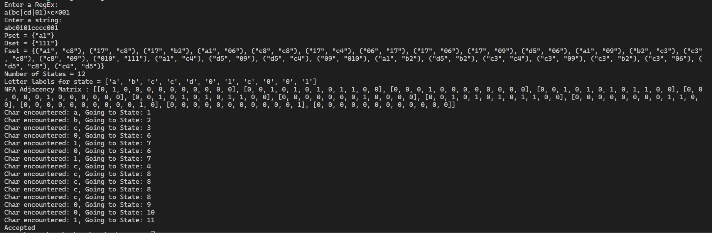

# String Matching with a RegEx

Uses Pest for parsing the RegEx input using my PEG and Glushkov Construction Algorithm to generate Glushkov NFA from a given Regular Expression.
The PEG imposes strict precendence of the order : Parenthesis > Star > Concatenation > Or and has been written by me (Roshan Prashant Bara)

For each alphabet in the regular expression a state is generated and is represented by **{alphabet}{StateNumber}**.
The screenshot of executed program is shown below. The program asks for a RegEx input and a string input and constructs a Glushkov NFA and then mathes the string using NFA execution.

## To Run
Type the following
```
cargo init
```
Now copy src forlder and .toml into your main project folder.
To execute run the following
```
cargo run
```


 
